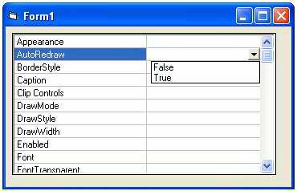



## PropertyList\_With\_MSFlexGrid

### Description

Create PropertyList control just like the one in VB.IDE
 
### More Info
 

             |
---                |---
**Submitted On**   |2004-08-24 13:29:18
**By**             |[Octoni](https://github.com/Planet-Source-Code/PSCIndex/blob/master/ByAuthor/octoni.md)
**Level**          |Advanced
**User Rating**    |4.3 (17 globes from 4 users)
**Compatibility**  |VB 6\.0
**Category**       |[OLE/ COM/ DCOM/ Active\-X](https://github.com/Planet-Source-Code/PSCIndex/blob/master/ByCategory/ole-com-dcom-active-x__1-29.md)
**World**          |[Visual Basic](https://github.com/Planet-Source-Code/PSCIndex/blob/master/ByWorld/visual-basic.md)
**Archive File**   |[PropertyLi1785598252004\.zip](https://github.com/Planet-Source-Code/octoni-propertylist-with-msflexgrid__1-55806/archive/master.zip)

